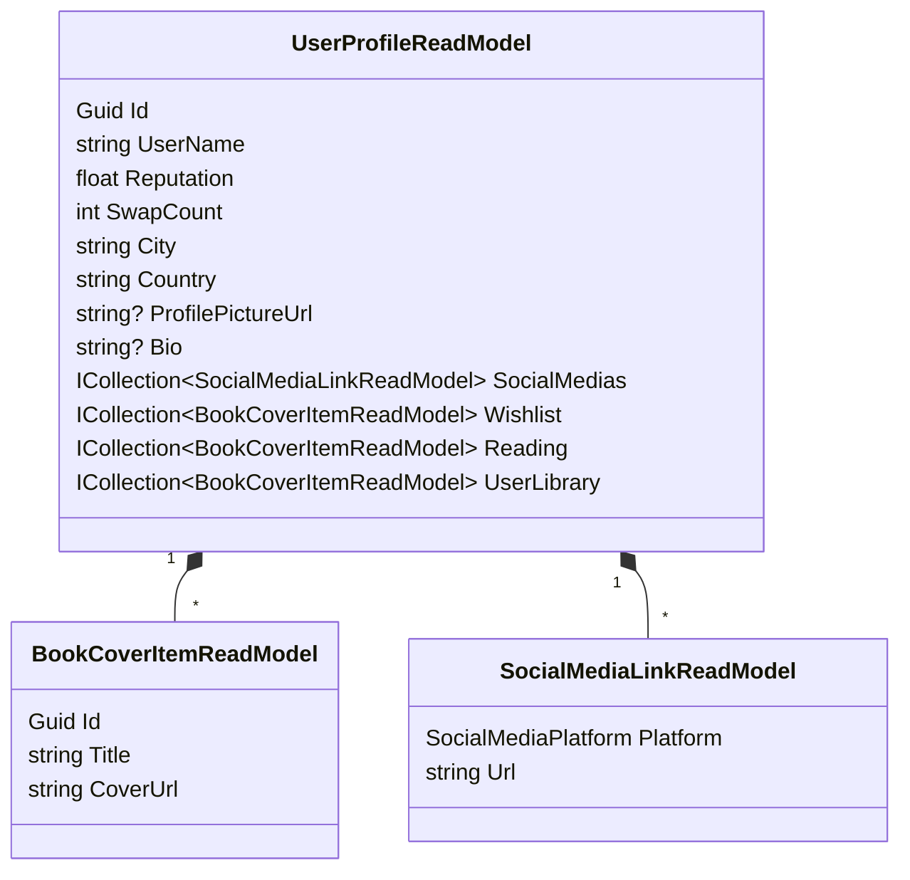
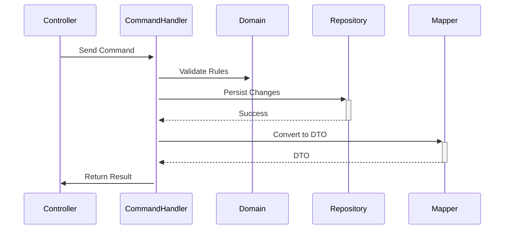
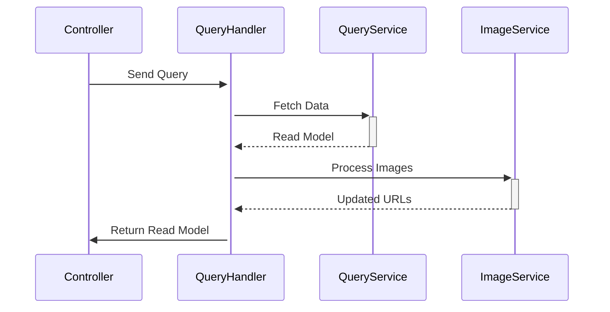

# Application Layer - The Use Case Orchestrator  
*Mediates between Presentation and Domain, implementing business workflows*

<!-- 
 
-->

*Implements use cases while abstracting infrastructure details*

## 🧩 Responsibility
- Coordinates domain objects to execute business workflows
- Defines application-specific business rules
- Implements CQRS pattern (Commands and Queries)
- Declares interfaces for infrastructure services
- Maps between domain objects and DTOs/Read Models
- Handles transactions and security concerns

**Dependency Rule**:  
Depends only on **Domain Layer**, defines interfaces implemented by **Infrastructure Layer**.

---

## ⚙️ Key Components

### 1. CQRS Pattern Implementation
**Command** (Write Operations):
```csharp
public record UpdateReadingProgressCommand(
    Guid UserBookId,
    int CurrentPage) : IRequest<Result<UserBookDto>>;

public class UpdateReadingProgressHandler 
    : IRequestHandler<UpdateReadingProgressCommand, Result<UserBookDto>>
{
    // Coordinates domain objects and persistence
}
```

**Query** (Read Operations - Optimized for UI):
```csharp
public record GetUserProfileQuery(Guid UserId) 
    : IRequest<Result<UserProfileReadModel>>;

public class GetUserProfileHandler
    : IRequestHandler<GetUserProfileQuery, Result<UserProfileReadModel>>
{
    private readonly IUserQueryService _userQuery;
    private readonly IImageStorageService _imageStorage;

    public GetUserProfileHandler(IUserQueryService userQuery, 
                                IImageStorageService imageStorage)
    {
        _userQuery = userQuery;
        _imageStorage = imageStorage;
    }

    public async Task<Result<UserProfileReadModel>> Handle(
        GetUserProfileQuery query, 
        CancellationToken cancellationToken)
    {
        return await _userQuery.GetDetailsAsync(query.UserId, cancellationToken);
    }
}
```

---

### 2. Application Services & Read Models
**Optimized read models for UI consumption**:


**Interface Definitions**:
```csharp
public interface IUserQueryService
{
    Task<UserProfileReadModel?> GetDetailsAsync(
        Guid userId, 
        CancellationToken cancellationToken);
    
    Task<PaginatedResult<UserSmallReadModel>> ListAsync(
        string userName, 
        float reputation, 
        string city, 
        string country, 
        string sortBy, 
        bool descending, 
        int offset, 
        int limit, 
        CancellationToken cancellationToken);
}

public interface IImageStorageService
{
    string GetImageUrl(string imageName);
}
```

---

### 3. Specialized Read Models
**Domain-Specific Optimizations**:
```csharp
// For book discovery
public sealed record GeneralBookListItem(
    Guid Id,
    string Title,
    string Author,
    string CoverUrl,
    float RatingAvg,
    BookGenre? PrimaryGenre = null,
    DateOnly? PublicationDate = null);

// For swap management
public sealed record UserSmallReadModel(
    Guid UserId,
    string Username,
    string? ProfilePictureUrl,
    float? UserReputation = null,
    string? City = null,
    string? Country = null,
    int? SwapCount = null);
```

---

## 🔁 Workflow Execution Patterns
**Command Workflow**:


**Query Workflow**:


---

## ⚡ Key Design Patterns

### 1. Optimized Read Pattern
```csharp
// UserProfileReadModel aggregates multiple data sources
public sealed record UserProfileReadModel(
    Guid Id,
    string UserName,
    float Reputation,
    int SwapCount,
    string City,
    string Country,
    string? ProfilePictureUrl,
    string? Bio,
    IReadOnlyCollection<SocialMediaLinkReadModel> SocialMedias,
    IReadOnlyCollection<BookCoverItemReadModel> Wishlist,
    IReadOnlyCollection<BookCoverItemReadModel> Reading,
    IReadOnlyCollection<BookCoverItemReadModel> UserLibrary
);
```

### 2. Contextual Data Projection
```csharp
// UserSmallReadModel shows different fields based on context
public record UserSmallReadModel(
    Guid UserId,
    string Username,
    string? ProfilePictureUrl,
    // Optional fields for different UI contexts:
    float? UserReputation = null,  // Shown in book swap views
    string? City = null,           // Shown in user search
    string? Country = null,        // Shown in user search
    int? SwapCount = null          // Shown in reputation views
);
```

### 3. Image Handling Abstraction
```csharp
public interface IImageStorageService
{
    string GetImageUrl(string imageName);
}

// Usage in handlers:
var profile = await _userQuery.GetDetailsAsync(userId);
profile.ProfilePictureUrl = _imageStorage.GetImageUrl(profile.ProfilePictureUrl);
```

---

## 📊 Real-World Implementation: User Profile Query
```csharp
public async Task<Result<UserProfileReadModel?>> Handle(
    GetUserProfileQuery request,
    CancellationToken cancellationToken)
{
    // 1. Fetch optimized read model
    var profile = await _userQuery.GetDetailsAsync(request.UserId);
    
    // 2. Process images through abstraction
    if (!string.IsNullOrEmpty(profile?.ProfilePictureUrl))
    {
        profile.ProfilePictureUrl = 
            _imageStorage.GetImageUrl(profile.ProfilePictureUrl);
    }
    
    // 3. Return UI-ready DTO
    return Result.Ok(profile);
}
```

---

## ✅ Benefits of This Structure
1. **UI-Specific Optimizations**  
   Read models tailored for different screens (profile, search, book cards)

2. **Performance Isolation**  
   Query services bypass domain complexity when not needed

3. **Image Abstraction**  
   Centralized image URL handling with storage service

4. **Contextual Data Exposure**  
   Optional fields in DTOs adapt to different use cases

5. **Deprecation Pathway**  
   Clear marking of legacy models (UserProjection)

---

## 📜 Next Steps
- [Domain Layer](./Backend.Domain/README.md)
- [Infrastructure Layer](../Infrastructure/README.md)
- [API Layer](./Backend.API/README.md)

> "The application layer is where use cases come to life,  
> coordinating domain objects without dirtying their hands with infrastructure concerns."
