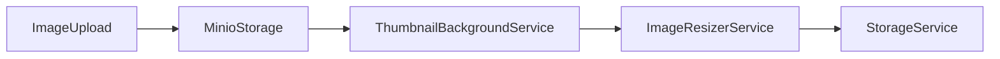
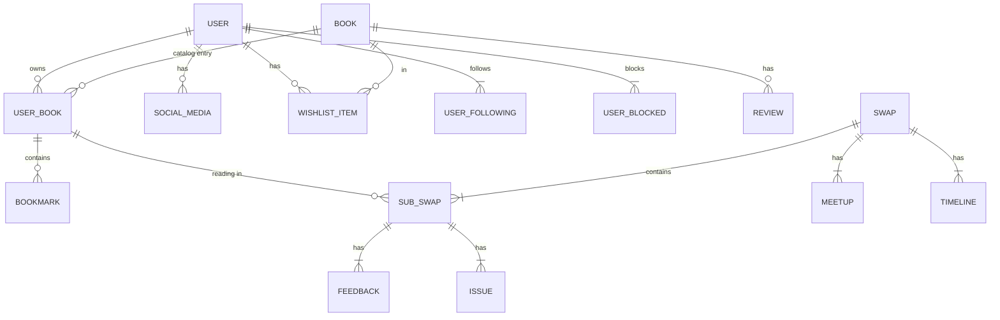

# Infrastructure Layer - The Concrete Foundation  
*Implements persistence, integrations, and infrastructure services*

<!-- 
  
*The outermost layer containing all implementation details*
-->

## 🏗️ Responsibility
- **Persistence**: Database access (EF Core), repositories
- **Background Services**: Asynchronous processing (thumbnails, queues)
- **External Services**: Email, image storage, authentication
- **Concrete Implementations**: 
  - Repository pattern implementations
  - Query service implementations
- **Mapping**: Between domain models and persistence entities
- **Configurations**: Database schema, migrations, DI registrations

**Dependency Rule**:  
Implements interfaces from **Application Layer**, depends on **Domain Layer** for business objects.

---

## ⚙️ Key Enhancements

### 1. Advanced Database Context
**AppDbContext** features:
- Shadow properties (`CreatedAt`/`UpdatedAt`) via `HasUpdatedAtAttribute`
- Complex value object mapping (coordinates as `decimal(10,7)`)
- Automatic audit tracking in `SaveChanges()`
- Check constraints for reputation/stars
- Split queries for performance

```csharp
protected override void OnModelCreating(ModelBuilder builder)
{
    // Apply global query filters
    builder.Entity<UserBookEntity>().HasQueryFilter(b => !b.IsDeleted);
    
    // Configure value objects
    builder.Entity<MeetupEntity>()
        .Property(m => m.Location_X).HasColumnType("decimal(10,7)");
}
```

**Persistence Entities** (Database-first design):
```csharp
public class UserBookEntity
{
    public Guid Id { get; set; }
    public Guid BookId { get; set; }
    public Guid OwnerId { get; set; }
    public BookStatus Status{ get; set; }
    public BookState State { get; set; }
    public int PageCount { get; set; }
    
    // Navigation properties
    public BookEntity Book { get; set; }
    public UserEntity Owner { get; set; }
}
```

---

### 2. Repository Implementations
Optimized write operations with:
- Scalar-only updates
- Collection synchronization
- Attach-only change tracking
- Domain error mapping

**UserBookRepository Example**:
```csharp
public async Task<Result> UpdateScalarsAsync(UserBook book)
{
    var stub = new UserBookEntity { Id = book.Id };
    _context.UserBooks.Attach(stub);
    
    // Selective property updates
    stub.Status = book.Status;
    stub.State = book.State;
    
    return await _context.SaveChangesWithResultAsync(...);
}
```

---

### 3. Advanced Query Services
Optimized reads with:
- Projection to DTOs
- Dynamic includes
- Pagination support
- Split queries

**UserQueryService**:
```csharp
public async Task<UserProfileReadModel?> GetDetailsAsync(Guid userId)
{
    return await _context.Users
        .Include(u => u.SocialMediaLinks)
        .Include(u => u.Wishlist)
        .ProjectTo<UserProfileReadModel>(_mapper.ConfigurationProvider)
        .FirstOrDefaultAsync(u => u.Id == userId);
}
```

---

### 4. Infrastructure Services
**Image Processing Pipeline**:


**Key Services**:
1. `MinioImageStorageService` - Cloud storage with presigned URLs
2. `ImageResizerService` - On-demand thumbnail generation
3. `IdentityService` - User management with ASP.NET Identity
4. `ThumbnailBackgroundService` - Queue-based image processing
5. `HttpUserContext` - Request-scoped user access

---

### 5. Background Processing
**Thumbnail Generation Service**:
- Channel-based queue system
- Automatic retries on MinIO errors
- Dead-letter handling

```csharp
protected override async Task ExecuteAsync(CancellationToken stoppingToken)
{
    while (await reader.WaitToReadAsync(stoppingToken))
    {
        // Process thumbnail requests from queue
        var result = await _resizer.GenerateThumbnailAsync(...);
        
        // Error handling with exponential backoff
        catch (MinioException ex) { ... }
    }
}
```

---

### 6. Security Implementation
**Identity Integration**:
- JWT authentication
- Role-based authorization
- Password hashing
- 2FA support (stub)

```csharp
public async Task<Result> CreateUserWithPasswordAsync(...)
{
    var user = new UserEntity { ... };
    var result = await _userManager.CreateAsync(user, password);
    
    return result.Succeeded 
        ? Result.Ok() 
        : Result.Fail(...);
}
```

---

## 🗄️ Enhanced Database Schema


---

## ⚡ Performance Optimization Highlights

1. **Attach-Only Updates**  
   Update only modified fields without loading entire entities:
   ```csharp
   var stub = new UserEntity { Id = userId };
   _context.Users.Attach(stub);
   stub.City = "London";
   _context.Entry(stub).Property(u => u.City).IsModified = true;
   ```

2. **Bulk Operations**  
   EF Core 8+ bulk updates:
   ```csharp
   await _context.UserBooks
       .Where(b => b.OwnerId == userId)
       .ExecuteUpdateAsync(setters => setters
           .SetProperty(b => b.StatusId, BookStatus.Unavailable));
   ```

3. **Projection Queries**  
   Select only required fields:
   ```csharp
   return await _context.Users
       .Select(u => new UserPreviewDto(u.Username, u.Reputation))
       .FirstOrDefaultAsync();
   ```

4. **Channel-based Queuing**  
   Background processing with backpressure:
   ```csharp
   private readonly Channel<ThumbnailRequest> _channel = 
       Channel.CreateBounded<ThumbnailRequest>(100);
   ```

---

## 🔐 Security Practices

1. **Parameterized Queries**  
   Prevent SQL injection with EF Core parameterization:
   ```csharp
   var user = await _context.Users
       .FromSqlInterpolated($"SELECT * FROM Users WHERE Email = {email}")
       .FirstOrDefaultAsync();
   ```

2. **Claim-based Authorization**  
   User context integration:
   ```csharp
   public Guid? UserId => 
       _contextAccessor.HttpContext?.User.GetUserId();
   ```

3. **Data Encryption**  
   Sensitive field encryption:
   ```csharp
   modelBuilder.Entity<User>()
       .Property(u => u.Email)
       .HasConversion(v => _encryptor.Encrypt(v), ...);
   ```

---

## 🚀 Getting Started with Database

1. Apply migrations:
   ```bash
   dotnet ef database update --project Infrastructure --startup-project Presentation
   ```

2. Seed initial data:
   ```csharp
   public static async Task SeedRolesAsync(RoleManager<IdentityRole<Guid>> roleManager)
   {
       foreach (var role in new[] { "Admin", "User" })
       {
           if (!await roleManager.RoleExistsAsync(role))
               await roleManager.CreateAsync(new IdentityRole<Guid>(role));
       }
   }
   ```

---


## 📜 Next Steps  
- [Domain Layer](../Backend.Domain/README.md)
- [Application Layer](../Backend.Application/README.md)
- [API Layer](../Backend.API/README.md)
- [General backend README](../README.md)
- [Project README](../../README.md)

> "Infrastructure is the bridge between abstract business rules  
> and the concrete reality of databases and external services."
