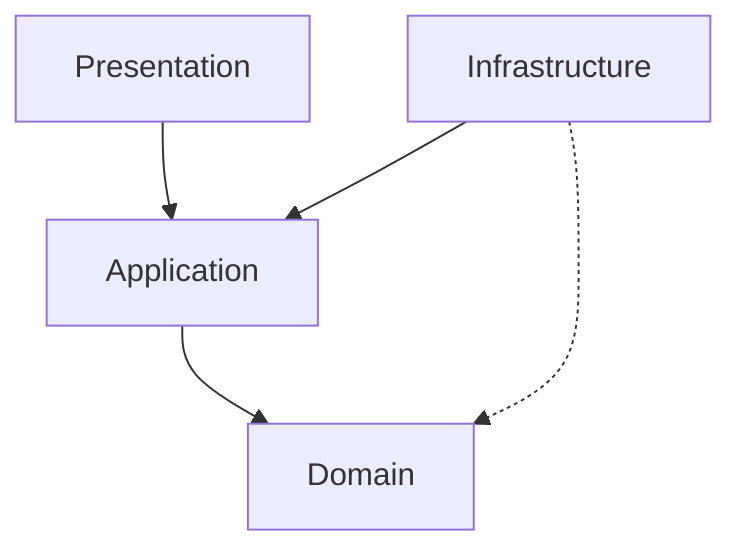
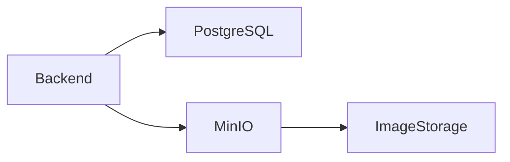

# BookSwap Backend - Clean Architecture Implementation  
*A community-driven book exchange platform*

## 📚 Project Overview  
BookSwap enables users to borrow/share books instead of buying new ones. Key features:  
- Digital library management with book status tracking  
- Book swapping with meeting coordination  
- Reading progress updates  
- Reputation system based on swap feedback  
- Social media integration for user communication  

**Design First Approach**:  
The application was first designed in Figma with detailed screens before implementation began.  
[View Figma Designs](https://www.figma.com/design/YhC9nWCKgyTJBFzh3iQDiC/main?node-id=22-14&t=SINBFbCife5wT7QQ-1)  

**Architecture Decision**:  
Adopted Clean Architecture (Onion Architecture) for maintainability, testability, and separation of concerns.  

## 🧅 Clean Architecture Overview  
  

### Key Principles  
1. **Independent of frameworks**  
2. **Testable**  
3. **Independent of UI**  
4. **Independent of database**  
5. **Independent of external agencies**  

---

## 🧩 Architecture Layers  

### 1. Domain Layer (Core)  
*Heart of the business logic*  
**Responsibilities**:  
- Enterprise-wide business rules  
- Aggregates, Entities, Value Objects  
- Domain events and exceptions  
- Enums and custom types  

**Key Components**:  
- **Value Objects**: Immutable objects with private fields accessed via methods  
  (e.g., `Address`, `BookStatus`, `SwapStatus`)  
- **Factory Pattern**: Used for object creation (e.g., `ErrorFactory`)  
- **Core Entities**: `User`, `Book`, `UserBook`, `Swap`  
- **Validation**: Domain objects contain their validation logic
<!-- - Domain Events: `SwapRequestedEvent`, `SwapCompletedEvent`  
I dont have those as i wasnt aware of them at the time -->

[View Domain Layer Details ➔](./Backend.Domain/README.md)  

### 2. Application Layer  
*Orchestrates domain objects*  
**Responsibilities**:  
- Mediates between Presentation and Domain  
- Implements CQRS pattern  
- Defines interfaces for infrastructure services  
- Contains application-specific business rules  

**CQRS Implementation**:  
| Component      | Responsibility                          | Example                     |
|----------------|-----------------------------------------|-----------------------------|
| **Commands**   | Create/Update/Delete operations         | `RequestSwapCommandHandler` |
| **Queries**    | Read-only optimized data retrieval      | `GetUserBooksQueryHandler`  |
| **Read Models**| DTOs optimized for query performance    | `BookDetailsDto`            |


[View Application Layer Details ➔](./Backend.Application/README.md)  

### 3. Infrastructure Layer  
*Concrete implementations*  
**Responsibilities**:  
- Data persistence (EF Core + PostgreSQL)  
- External service integrations (MinIO, Email)  
- Implementation of application interfaces  
- Background services (image processing)  

**Key Components**:  
- **EF Core**: Entity configurations and migrations  
- **Repositories**: Bridge between domain and persistence  
- **Query Services**: Optimized data access for queries  
- **MinIO Integration**: Image storage and processing  
- **Health Checks**: System monitoring endpoints  

[View Infrastructure Details ➔](./Backend.Infrastructure/README.md)  

### 4. Presentation Layer (API)  
*System entry point*  
**Responsibilities**:  
- HTTP request handling  
- Authentication/Authorization (Cookies)  
- Input validation (FluentValidation)  
- Exception handling middleware  
- API documentation (Swagger)  

**Key Components**:  
- **Controllers**: Thin layer invoking MediatR handlers  
- **DTOs**: Data transfer objects for API contracts  
- **Middleware**: Centralized error handling  
- **Dependency Registration**: Clean service configuration  

[View API Documentation ➔](./Backend.API/README.md)  

---

## ⬇️ Layer Dependencies  


**Dependency Rule**: Inner layers never depend on outer layers
**Dependency Flow**:  
1. Presentation calls Application layer commands/queries  
2. Application uses Domain models and business rules  
3. Infrastructure implements Application interfaces  
4. Infrastructure may reference Domain value objects  

---

## 🛠️ Technology Stack  
| Layer           | Technologies                                                                 |
|-----------------|------------------------------------------------------------------------------|
| **Core**        | .NET 8, C# 11, FluentResults                                                 |
| **Application** | MediatR, AutoMapper, FluentValidation                                        |
| **Persistence** | Entity Framework Core 8, PostgreSQL, MinIO (object storage)                  |
| **API**         | ASP.NET Core Web API, Swagger/OpenAPI, JWT Authentication                    |
| **Patterns**    | CQRS, Repository Pattern, Unit of Work                                       |
| **Infra**       | Docker, SixLabors.ImageSharp (image processing), Background Services         |
| **Health**      | Custom health checks (database, services)                                    |

---

## 🐳 Docker Architecture  


**Services**:  
- **Backend**: ASP.NET Core API (ports 5000/5001)  
- **PostgreSQL**: Primary data store  
- **MinIO**: Image storage service  
- **Image Processing**: Background thumbnail generation  

---

## ▶️ Getting Started  
```bash
# Clone repository
git clone https://github.com/Radoslaw-Wolnik/Licencjat.git

cd Backend

# 1. Restore dependencies
dotnet restore

# 2.1 Set up database
docker-compose up -d postgres

# 2.2 Create initial migration
dotnet ef migrations add InitialCreate --project Backend.Infrastructure --startup-project Backend.API
# 2.3 Apply the migration to the dataabase
dotnet ef database update --project Backend.Infrastructure --startup-project Backend.API

# In case of updating the migrations do
dotnet ef migrations remove --project Backend.Infrastructure --startup-project Backend.API

# In case you want to drop the databse:
dotnet ef database drop --project Backend.Infrastructure --startup-project Backend.API

# 3. Start containers
docker-compose up --build --d
# --d for detached

# 4. Test API
curl https://localhost:5000/swagger
```

### ✅ Testing <!-- ✔ -->
```bash
# for testing simply run dotnet test in the solution directory - Licencjat/Backend
dotnet test

# for integration tests cerate a volume for MinIO service
docker volume create minio-test-data
# and then run tests

```

---

## 📂 Project Structure  
```
BookSwap/
├── Domain/               # Core business models
├── Application/          # Use cases & business logic
├── Infrastructure/       # Database & external services
├── API/                  # Web API layer - Presentation
└── Tests/                # Unit/integration tests
```

---

## 📜 Next Steps  
1. Explore layer-specific documentation:  
   - [Domain Layer](./Backend.Domain/README.md)  
   - [Application Layer](./Backend.Application/README.md)  
   - [Infrastructrure Layer](./Backend.Infrastructure/README.md)  
   - [Presentation Layer](./Backend.API/README.md)

2. View [Frontend Implementation](... coming soon) 
3. Check [Figma Designs](https://www.figma.com/design/YhC9nWCKgyTJBFzh3iQDiC/main?node-id=22-14&t=SINBFbCife5wT7QQ-1)  

This architecture ensures:  
✅ Decoupled business logic from implementation details  
✅ Easy replacement of components (e.g., switch databases)  
✅ Independent testability of layers  
✅ Long-term maintainability as features evolve