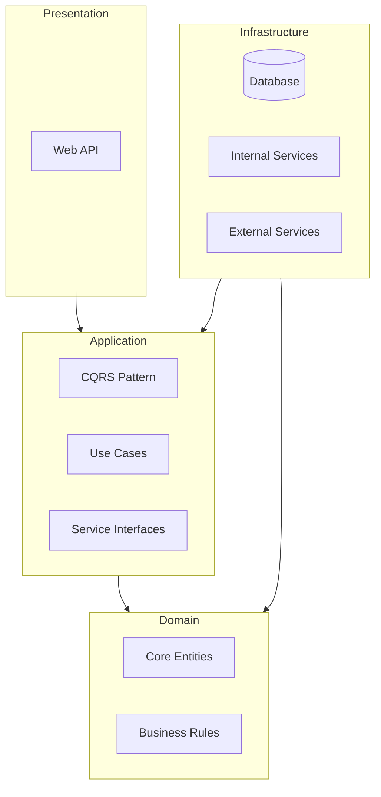

# BookSwap - Community Book Exchange Platform 🌱📚  

  
*A community-powered platform for sharing books instead of buying new ones*

## 🌟 Inspiration  
Inspired by the sharing economy movement and community tool libraries, BookSwap enables users to:  
- **Share** books instead of buying new ones  
- **Connect** with fellow book lovers in your area  
- **Track** reading progress and swap histories  
- **Build** reputation through successful swaps  

[View Full Figma Design](https://www.figma.com/design/YhC9nWCKgyTJBFzh3iQDiC/main?node-id=22-14&t=SINBFbCife5wT7QQ-1)  

## 🧩 System Architecture  
We follow Clean Architecture principles for maintainability and testability:  



### Key Layers  
| Layer | Description | Documentation |  
|-------|-------------|---------------|  
| **Presentation** | API endpoints, controllers, and DTOs | [View README](./Backend/Backend.API/README.md) |  
| **Application** | Use cases, CQRS implementation | [View README](./Backend/Backend.Application/README.md) |  
| **Domain** | Core business models and rules | [View README](./Backend/Backend.Domain/README.md) |  
| **Infrastructure** | Database, repositories, services | [View README](./Backend/Backend.Infrastructure/README.md) |  

## ✨ Key Features  
- **Digital Library Management**  
  Track books with reading status and bookmarks  
- **Book Swapping System**  
  Request, accept, and complete swaps with meeting coordination  
- **Reading Progress Tracking**  
  Update current reading page for each book  
- **Reputation System**  
  Earn feedback points after successful swaps  
- **Social Integration**  
  Connect via social profiles instead of built-in chat  

## 🚀 Getting Started  

### Prerequisites  
- .NET 8 SDK  
- Node.js 18+ (for frontend)  
- Docker Desktop  
- PostgreSQL 15+  

### Backend Setup  
```bash
# Clone repository
git clone https://github.com/yourusername/bookswap.git
cd bookswap/backend

# Set up database
docker-compose up -d postgres

# Run migrations
dotnet ef database update --project Infrastructure --startup-project Presentation

# Start backend
dotnet run --project Presentation
```
API will be available at `https://localhost:5001/swagger`

### Frontend Setup (Coming Soon!)  
```bash
cd bookswap/frontend
npm install
npm run dev
```
Frontend will run at `http://localhost:3000`

## 🌱 Project Roadmap  
- [x] Complete Figma designs  
- [x] Implement backend architecture  
- [x] Setup database schema  
- [x] Develop core swapping workflow  
- [x] Implement user reputation system  
- [ ] Build frontend  


## 🤝 How to Contribute  
1. Fork the repository  
2. Create your feature branch (`git checkout -b feature/amazing-feature`)  
3. Commit your changes (`git commit -m 'Add some amazing feature'`)  
4. Push to the branch (`git push origin feature/amazing-feature`)  
5. Open a pull request  

## 📜 License  
Distributed under the MIT License. See `LICENSE` for more information.

## 📬 Contact  
Project Maintainer - Radoslaw Wolnik - radoslaw.m.wolnik@gmail.com
Project Link - [https://github.com/Radoslaw-Wolnik/Licencjat](https://github.com/Radoslaw-Wolnik/Licencjat)

---

**Share Knowledge • Build Community • Reduce Waste**  
*One book swap at a time* ♻️❤️